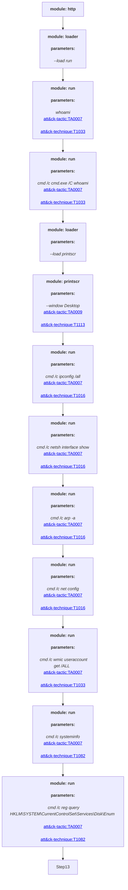

 #Attack Graph

```mermaid
graph TD
Step0["<b> module: http </b> <br>"]
Step1["<b> module: loader </b> <br><h4> parameters: </h4> <i> --load run </i> <br>"]
Step2["<b> module: run </b> <br><h4> parameters: </h4> <i> whoami </i> <br><a href='https://attack.mitre.org/tactics/TA0007'>att&ck-tactic:TA0007</a><br>
<a href='https://attack.mitre.org/techniques/T1033'>att&ck-technique:T1033</a><br>
"]
Step3["<b> module: run </b> <br><h4> parameters: </h4> <i> cmd /c cmd.exe /C whoami </i> <br><a href='https://attack.mitre.org/tactics/TA0007'>att&ck-tactic:TA0007</a><br>
<a href='https://attack.mitre.org/techniques/T1033'>att&ck-technique:T1033</a><br>
"]
Step4["<b> module: loader </b> <br><h4> parameters: </h4> <i> --load printscr </i> <br>"]
Step5["<b> module: printscr </b> <br><h4> parameters: </h4> <i> --window Desktop </i> <br><a href='https://attack.mitre.org/tactics/TA0009'>att&ck-tactic:TA0009</a><br>
<a href='https://attack.mitre.org/techniques/T1113'>att&ck-technique:T1113</a><br>
"]
Step6["<b> module: run </b> <br><h4> parameters: </h4> <i> cmd /c ipconfig /all </i> <br><a href='https://attack.mitre.org/tactics/TA0007'>att&ck-tactic:TA0007</a><br>
<a href='https://attack.mitre.org/techniques/T1016'>att&ck-technique:T1016</a><br>
"]
Step7["<b> module: run </b> <br><h4> parameters: </h4> <i> cmd /c netsh interface show </i> <br><a href='https://attack.mitre.org/tactics/TA0007'>att&ck-tactic:TA0007</a><br>
<a href='https://attack.mitre.org/techniques/T1016'>att&ck-technique:T1016</a><br>
"]
Step8["<b> module: run </b> <br><h4> parameters: </h4> <i> cmd /c arp -a </i> <br><a href='https://attack.mitre.org/tactics/TA0007'>att&ck-tactic:TA0007</a><br>
<a href='https://attack.mitre.org/techniques/T1016'>att&ck-technique:T1016</a><br>
"]
Step9["<b> module: run </b> <br><h4> parameters: </h4> <i> cmd /c net config </i> <br><a href='https://attack.mitre.org/tactics/TA0007'>att&ck-tactic:TA0007</a><br>
<a href='https://attack.mitre.org/techniques/T1016'>att&ck-technique:T1016</a><br>
"]
Step10["<b> module: run </b> <br><h4> parameters: </h4> <i> cmd /c wmic useraccount get /ALL </i> <br><a href='https://attack.mitre.org/tactics/TA0007'>att&ck-tactic:TA0007</a><br>
<a href='https://attack.mitre.org/techniques/T1033'>att&ck-technique:T1033</a><br>
"]
Step11["<b> module: run </b> <br><h4> parameters: </h4> <i> cmd /c systeminfo </i> <br><a href='https://attack.mitre.org/tactics/TA0007'>att&ck-tactic:TA0007</a><br>
<a href='https://attack.mitre.org/techniques/T1082'>att&ck-technique:T1082</a><br>
"]
Step12["<b> module: run </b> <br><h4> parameters: </h4> <i> cmd /c reg query HKLM\SYSTEM\CurrentControlSet\Services\Disk\Enum </i> <br><a href='https://attack.mitre.org/tactics/TA0007'>att&ck-tactic:TA0007</a><br>
<a href='https://attack.mitre.org/techniques/T1082'>att&ck-technique:T1082</a><br>
"]
Step0 --> Step1
Step1 --> Step2
Step2 --> Step3
Step3 --> Step4
Step4 --> Step5
Step5 --> Step6
Step6 --> Step7
Step7 --> Step8
Step8 --> Step9
Step9 --> Step10
Step10 --> Step11
Step11 --> Step12
Step12 --> Step13
```
