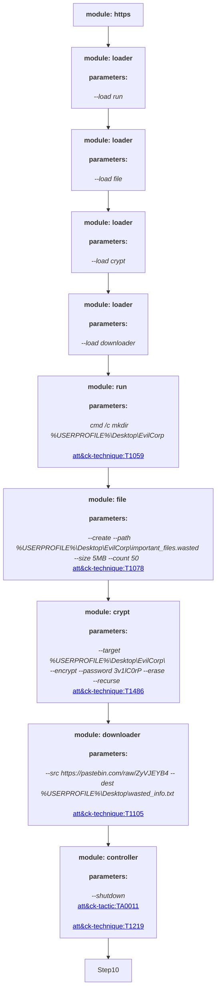

This threat is explained further in SCYTHE's Threat Thursday blog: https://www.scythe.io/library/threatthursday-evil-corp

To Emulate:

1. Download and import the threat in JSON format to your SCYTHE instance - https://github.com/scythe-io/community-threats/blob/master/EvilCorp/WastedLocker_scythe_threat.json
2. Go to the Threat Catalog and select "WastedLocker"
3. Click "Create Campaign from Threat"
4. Name the Campaign
5. Parameters: Replace --cp 35.229.19.7:443 with your SCYTHE instance IP address or FQDN.
6. Launch the Campaign

 #Attack Graph

