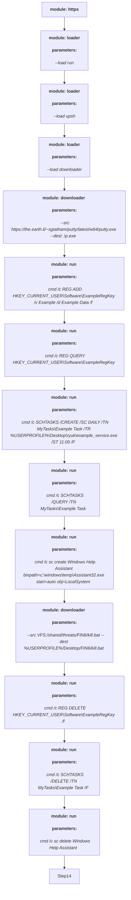

 #Attack Graph

```mermaid
graph TD
Step0["<b> module: https </b> <br>"]
Step1["<b> module: loader </b> <br><h4> parameters: </h4> <i> --load run </i> <br>"]
Step2["<b> module: loader </b> <br><h4> parameters: </h4> <i> --load upsh </i> <br>"]
Step3["<b> module: loader </b> <br><h4> parameters: </h4> <i> --load downloader </i> <br>"]
Step4["<b> module: downloader </b> <br><h4> parameters: </h4> <i> --src https://the.earth.li/~sgtatham/putty/latest/w64/putty.exe --dest .\p.exe </i> <br>"]
Step5["<b> module: run </b> <br><h4> parameters: </h4> <i> cmd /c REG ADD HKEY_CURRENT_USER\Software\ExampleRegKey /v Example /d Example Data /f </i> <br>"]
Step6["<b> module: run </b> <br><h4> parameters: </h4> <i> cmd /c REG QUERY HKEY_CURRENT_USER\Software\ExampleRegKey </i> <br>"]
Step7["<b> module: run </b> <br><h4> parameters: </h4> <i> cmd /c SCHTASKS /CREATE /SC DAILY /TN MyTasks\Example Task /TR %USERPROFILE%\Desktop\ryuk\example_service.exe /ST 11:00 /F </i> <br>"]
Step8["<b> module: run </b> <br><h4> parameters: </h4> <i> cmd /c SCHTASKS /QUERY /TN MyTasks\Example Task </i> <br>"]
Step9["<b> module: run </b> <br><h4> parameters: </h4> <i> cmd /c sc create Windows Help Assistant binpath=c:\windows\temp\Assistant32.exe start=auto obj=LocalSystem </i> <br>"]
Step10["<b> module: downloader </b> <br><h4> parameters: </h4> <i> --src VFS:/shared/threats/FIN6/kill.bat --dest %USERPROFILE%/Desktop/FIN6/kill.bat </i> <br>"]
Step11["<b> module: run </b> <br><h4> parameters: </h4> <i> cmd /c REG DELETE HKEY_CURRENT_USER\Software\ExampleRegKey /f </i> <br>"]
Step12["<b> module: run </b> <br><h4> parameters: </h4> <i> cmd /c SCHTASKS /DELETE /TN MyTasks\Example Task /F </i> <br>"]
Step13["<b> module: run </b> <br><h4> parameters: </h4> <i> cmd /c sc delete Windows Help Assistant </i> <br>"]
Step0 --> Step1
Step1 --> Step2
Step2 --> Step3
Step3 --> Step4
Step4 --> Step5
Step5 --> Step6
Step6 --> Step7
Step7 --> Step8
Step8 --> Step9
Step9 --> Step10
Step10 --> Step11
Step11 --> Step12
Step12 --> Step13
Step13 --> Step14
```
